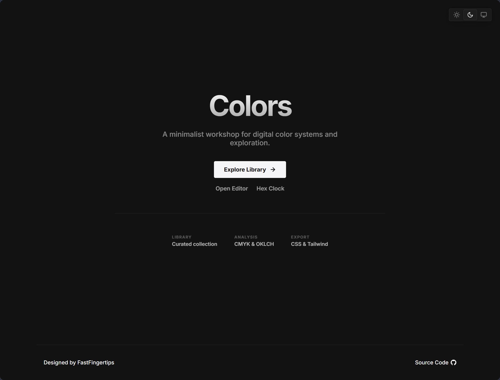
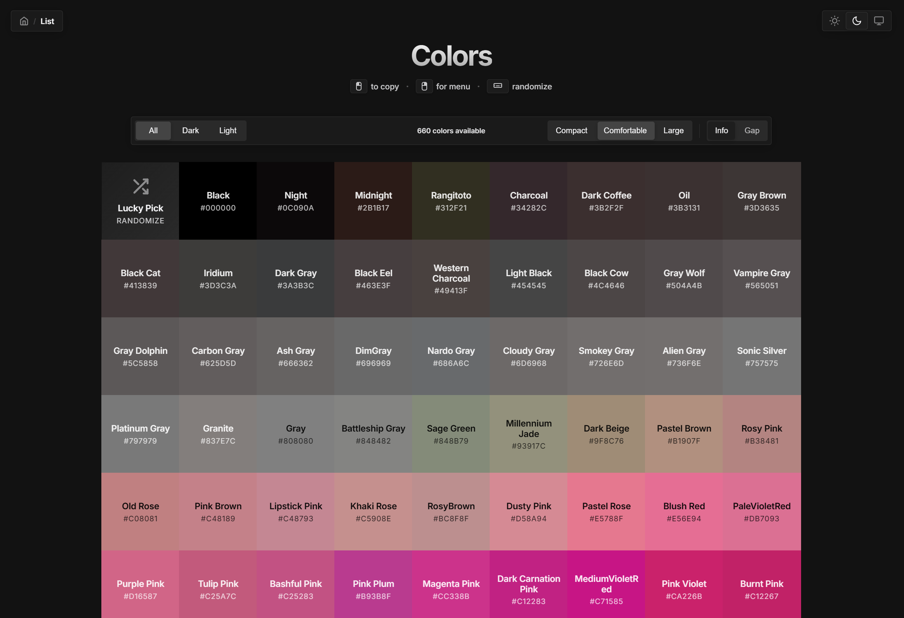
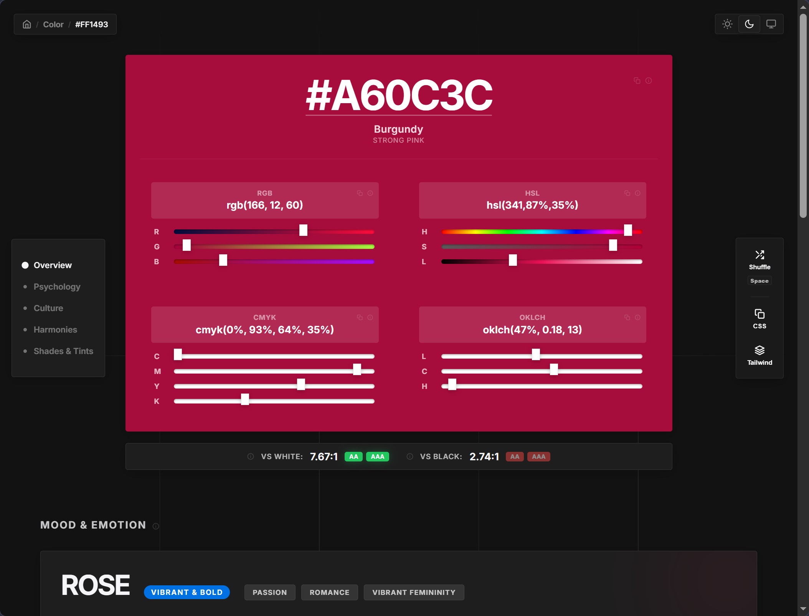
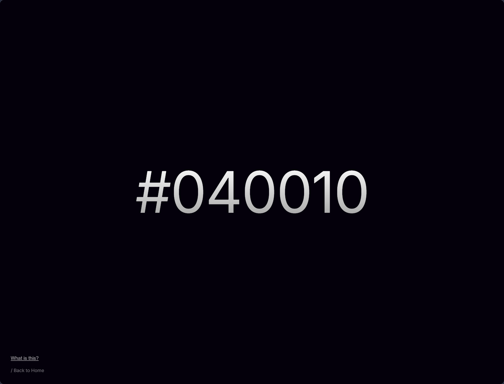

<div align="center">

# Colors

Color management tool built with Astro and TypeScript.

[](https://colors.bugra.co/)
[](https://astro.build)
[](https://www.typescriptlang.org)
[](LICENSE)

</div>

## Features

<table>
  <tr>
    <td width="60%" valign="top">
      <h3><a href="https://colors.bugra.co/">Home</a> (<code>/</code>)</h3>
      <ul>
        <li>Minimalist workshop overview</li>
        <li>Quick navigation to library, editor, and clock</li>
        <li>Key system specs and feature highlights</li>
      </ul>
    </td>
    <td width="40%" align="center" valign="middle">
      <a href="https://colors.bugra.co/"></a>
    </td>
  </tr>
  <tr>
    <td width="60%" valign="top">
      <h3><a href="https://colors.bugra.co/list">Color Library</a> (<code>/list</code>)</h3>
      <ul>
        <li>Filter colors by light and dark tone</li>
        <li>Adjust grid layout size (compact, comfortable, large)</li>
        <li>Click any card to copy HEX code</li>
        <li>Right-click context menu to copy RGB, HSL, or CSS variable formats</li>
        <li>Spacebar shortcut to select a random color</li>
      </ul>
    </td>
    <td width="40%" align="center" valign="middle">
      <a href="https://colors.bugra.co/list"></a>
    </td>
  </tr>
  <tr>
    <td width="60%" valign="top">
      <h3><a href="https://colors.bugra.co/color/0071E3">Color Inspector</a> (<code>/color/[hex]</code>)</h3>
      <ul>
        <li>Interactive sliders for RGB, HSL, CMYK, and OKLCH color spaces</li>
        <li>WCAG AA and AAA contrast ratings against black and white</li>
        <li>Harmony generators (Complementary, Triadic, Analogous, Split-Complementary)</li>
        <li>Shades and tints generation</li>
        <li>Emotional psychology and regional cultural meanings</li>
        <li>One-click copy for CSS variables and Tailwind config</li>
      </ul>
    </td>
    <td width="40%" align="center" valign="middle">
      <a href="https://colors.bugra.co/color/0071E3"></a>
    </td>
  </tr>
  <tr>
    <td width="60%" valign="top">
      <h3><a href="https://colors.bugra.co/clock">Hex Clock</a> (<code>/clock</code>)</h3>
      <ul>
        <li>Real-time time-to-color mapping where hours, minutes, and seconds represent RGB components (<code>#HHMMSS</code>)</li>
        <li>Dynamic background color transition</li>
        <li>Hover interface controls and explanatory panel</li>
      </ul>
    </td>
    <td width="40%" align="center" valign="middle">
      <a href="https://colors.bugra.co/clock"></a>
    </td>
  </tr>
</table>

## Run Locally

```bash
npm install
npm run dev
```

<br />

<div align="center">
  <sub>Dedicated to <a href="https://github.com/Lenochxd">Lenoch</a></sub>
</div>
